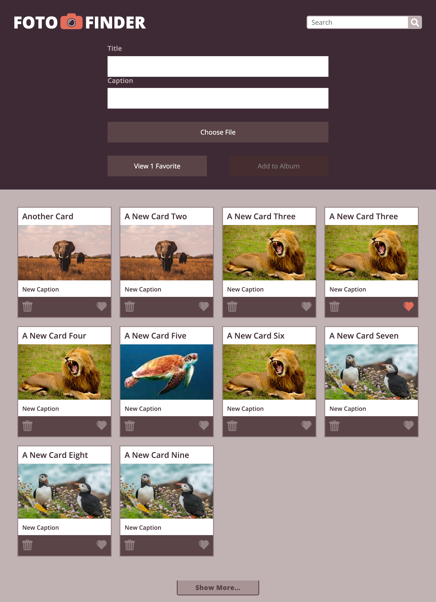

# Foto Finder

## Project Description
> http://frontend.turing.io/projects/foto-finder-final.html
> Foto Finder is an app that allows someone to upload a photo caption and title and then post to the DOM a card made up of the users input. The Card will then be saved to localstorage so that it will persist upon reload. There is a functionality to favorite specific cards and then view all the photos that are favorited. As well the user can update the title or caption of the their specific card too. Last you can search through all the cards and only show the ones that match that description.

## Learning Experience
> This project was a learning experience to improve upon the building of my javascript knowledge. The main part I focused on was trying to build out solid and dynamic functions that could be use throughout my code base multiple times.

## Built With
This project was build with the following
- HTML
- CSS
- Javascript
- JSON
- localStorage

### Foto Finder Comp

### My Assignment Screen Grab

